---
hide:
  - footer
---

<h1>Andy (Tsz Kin) Chan</h1>

:fontawesome-brands-github: [tkchanat](https://github.com/tkchanat) | :fontawesome-brands-twitter: [@tkchanat](https://twitter.com/tkchanat1) | :fontawesome-brands-linkedin: [Andy Chan](https://www.linkedin.com/in/andy-chan-9b8294155/) | :fontawesome-solid-location-dot: Vancouver, BC

{:style="width:200px; height:200px; object-fit: cover; border-radius: 15%; box-shadow: 0px 4px 16px rgba(0, 0, 0, 0.5);"}

I am a rendering software engineer at [Animal Logic](https://animallogic.com/) Vancouver, developing in-house production renderer [_Glimpse_](https://animallogic.com/technology/products/glimpse/). I love both offline and realtime graphics. My main interests are light transport and Monte Carlo path tracer, but any compute graphics related topics fascinate me too.

This site is my dedicated graphics dump yard where you can (occasionally) find some useful knowledge. Happy diving!

---

## Experience
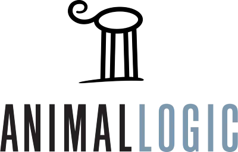{:style="width:150px;vertical-align:middle"} 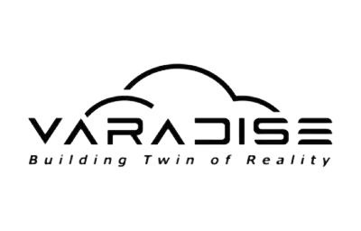{:style="width:200px;vertical-align:middle"}

* Trademarks of the above are owned by their respective companies and publishers.

---
## Publication
{:style="width:200px"}

**Can You See the Heat? A Null-scattering Approach for Refractive Volume Rendering** - SIGGRAPH 2023

_Basile Fraboni, Tsz Kin Chan, Thibault Vergne, Jakub Jeziorski_

[[Project Page]](https://animallogic.com/technology/publications/can-you-see-the-heat/) | [[Paper]](https://animallogic.com/wp-content/uploads/2023/08/Can-you-see-the-Heat.pdf)

---

## Personal Projects
Migrating from old webpage :material-wrench-clock:

---

## Education 
**Hong Kong University of Science and Technology**, _HK_ (2016 - 2020)

_Bachelor of Engineering, Computer Science_

- Advanced Computer Graphics
- Applied Statistics and Linear Algebra
- Computer Organization and Operating System
- Data Structure and Algorithms
- Software Engineering

**KTH Royal Institue of Technology**, _Sweden_ (2019 Jan - June)

_Exchange Study, Master's Program_

- Computer Graphics and Interaction
- Music Communication and Music Technology
- Machine Learning

---

## Skills

<h3>Tools & Application</h3>
|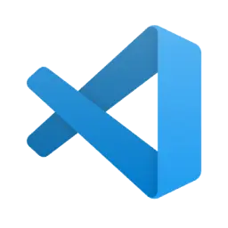{:style="width:50px"}|{:style="width:50px"}|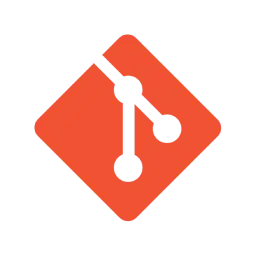{:style="width:50px"}|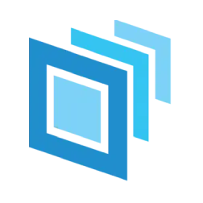{:style="width:50px"}|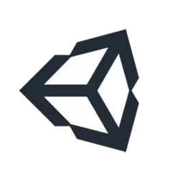{:style="width:50px"}|{:style="width:50px"}|{:style="width:50px"}|
|:--:|:--:|:--:|:--:|:--:|:--:|:--:|
|VSCode|VisualStudio|Git|OpenUSD|Unity|UE4|Blender|

<h3>Programming Languages</h3>
|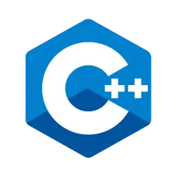{:style="width:50px"}|{:style="width:50px"}|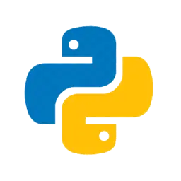{:style="width:50px"}|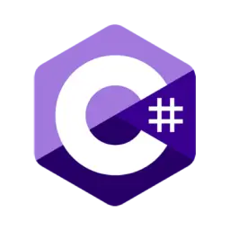{:style="width:50px"}|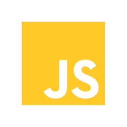{:style="width:50px"}|
|:--:|:--:|:--:|:--:|:--:|
|C++|Rust|Python|C#|Javascript|

<h3>Graphics API</h3>
|{:style="width:50px"}|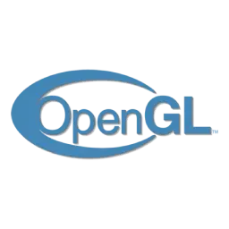{:style="width:50px"}|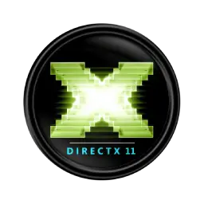{:style="width:50px"}|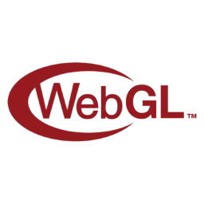{:style="width:50px"}|
|:--:|:--:|:--:|:--:|
|Vulkan|OpenGL|DirectX 11|WebGL|