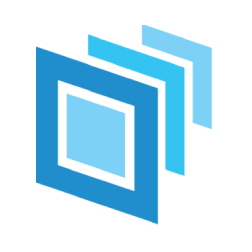

---
hide:
  - footer
---

{:style="width:200px; border-radius: 20%"}

<h1>Andy (Tsz Kin) Chan</h1>

:fontawesome-brands-github: [tkchanat](https://github.com/tkchanat) | :fontawesome-brands-twitter: [@tkchanat](https://twitter.com/tkchanat1) | :fontawesome-brands-linkedin: [Andy Chan](https://www.linkedin.com/in/andy-chan-9b8294155/) | :fontawesome-solid-location-dot: Vancouver, BC

Rendering software engineer at [Animal Logic](https://animallogic.com/) Vancouver, being part of developing the glimpse renderer. I write codes in both realtime and offline graphics. Fascinated by light transport and Monte Carlo path tracers. 

---

## Projects
Migrating from old webpage :material-wrench-clock:

---

## Experience
{:style="width:150px;vertical-align:middle"} {:style="width:200px;vertical-align:middle"}

* Trademarks of the above are owned by their respective companies and publishers.

---
## Publication
{:style="width:200px"}

**Can You See the Heat? A Null-scattering Approach for Refractive Volume Rendering** - SIGGRAPH 2023

_Basile Fraboni, Tsz Kin Chan, Thibault Vergne, Jakub Jeziorski_

[[Project Page]](https://animallogic.com/technology/publications/can-you-see-the-heat/) | [[Paper]](https://animallogic.com/wp-content/uploads/2023/08/Can-you-see-the-Heat.pdf)

---

## Education 
**Hong Kong University of Science and Technology**, _HK_ (2016 - 2020)

_Bachelor of Engineering, Computer Science_

- Advanced Computer Graphics
- Applied Statistics and Linear Algebra
- Computer Organization and Operating System
- Data Structure and Algorithms
- Software Engineering

**KTH Royal Institue of Technology**, _Sweden_ (2019 Jan - June)

_Exchange Study, Master's Program_

- Computer Graphics and Interaction
- Music Communication and Music Technology
- Machine Learning

---

## Skills

<h3>Tools & Application</h3>
|{:style="width:50px"}|{:style="width:50px"}|{:style="width:50px"}|{:style="width:50px"}|{:style="width:50px"}|{:style="width:50px"}|{:style="width:50px"}|
|:--:|:--:|:--:|:--:|:--:|:--:|:--:|
|VSCode|VisualStudio|Git|USD|Unity3D|UE4|Blender|

<h3>Programming Languages</h3>
|{:style="width:50px"}|{:style="width:50px"}|{:style="width:50px"}|{:style="width:50px"}|{:style="width:50px"}|
|:--:|:--:|:--:|:--:|:--:|
|C++|Rust|Python|C#|Javascript|

<h3>Graphics API</h3>
|{:style="width:50px"}|{:style="width:50px"}|{:style="width:50px"}|{:style="width:50px"}|
|:--:|:--:|:--:|:--:|
|Vulkan|OpenGL|DirectX 11|WebGL|