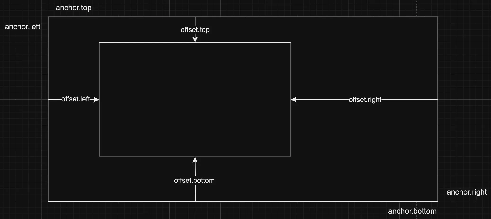
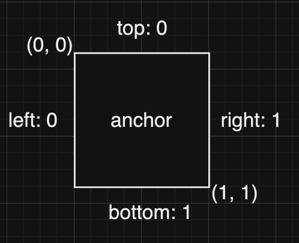

# Retained Mode GUI

## UI Placement
I did a lot of references on how other game engines handle graphical user interfaces, i.e. Unreal, Unity, Godot, etc. They all seem to arrive to a consensus on how to do dynamic UI positioning. That is, using **anchor** and **offsets**. 


### Anchor
Anchor defines a rectangular area relative to the parent element in terms of its ratio. On the x-axis, 0 represents the left edge and 1 represents the right edge. On the y-axis, o represents the top edge and 1 represents the bottom edge. If anchor is set to (left: 0.1, top: 0.1, right: 0.8, bottom: 0.8), this means the child element will start at 10% until 80% of the parent bound.
{:style="width:300px"}

### Offset
Offset is literally the offsets from the rectangular area defined by the anchor attribute as shown above. Following the same coordaintes, +X points to the right of the screen and +Y points to the bottom of the screen. This is just a way to fine tune the position of the child UI element relative to its parent.

### Adding it up!
To make it more obvious, here's a code snippet describing how the child region is calculated from its parent bound.
```cpp
UIRect {
  .left = parent_rect.left + parent_width * anchor.left + offset.left,
  .top = parent_rect.top + parent_height * anchor.top + offset.top,
  .right = parent_rect.left + parent_width * anchor.right + offset.right,
  .bottom = parent_rect.top + parent_height * anchor.bottom + offset.bottom
}
```