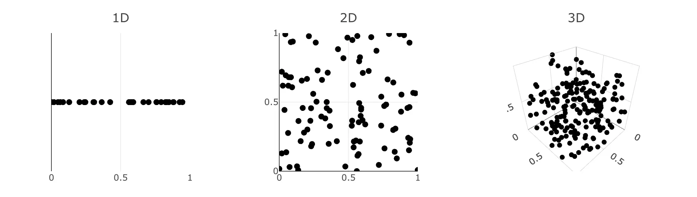
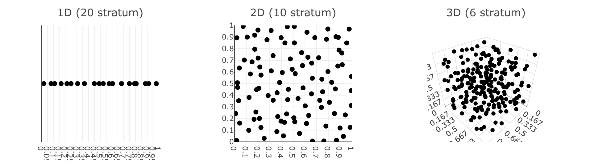

# Sampling Techniques
Puseudo-random noise usually don't produce good uniform samples. It often produces clusters and void within the sample space. That means the sample space is not well explored, either wasting samples on similar areas or even complete ignoring some subregions. And this scales to any dimensions.

## Stratified Sampling
Instead of recklessly scatter points around, how about subdiving the domain $\Omega$ into non-overlapping regions $\Omega_1, \dots, \Omega_n$. Noted that the union of them must cover the whole domain.

$$
\bigcup_{i=1}^n{\ \Omega_i} = \Omega
$$

This works pretty well in low-dimensional integration problems. However unfortunately, this suffers the same problem as the quadrature rules where it won't perform well in high frequency signals.

## Low-Discrepancy Sequences
If randomness are difficult to control, how about herding the points to position in a deterministic pattern such that they are _almost_ equal distance to each other? In other words, how do we get an equidistribution of samples?

### Defining Discrepancy
Imagine a $s$-dimentional unit cube $\mathbb{I}^s = [0, 1)^s$, with a point set $P = {x_1, x_2, \dots, x_N} \in \mathbb{I}^s$. We define the point set discrepancy $\mathcal{D}(J, P)$ as follows:

$$
\mathcal{D}(J, P) = \left|\frac{A(J)}{N} - V(J)\right|
$$

You can think of $\mathcal{D}(J, P)$ as the proportion of points inside a sub-interval $J$, where $A(J)$ is the number of points $x_i \in J$ and $V(J)$ is the volume of $J$. 

The worst-case discrepancy is called the _star-discrepancy_ and is defined as:

$$
\mathcal{D^*}(N)=\sup_{J\in\mathbb{I^s}}{|\mathcal{D}(J;P)|}
$$

A good sequence should minimize such _star-discrepancy_ $\mathcal{D^*}(N)$ to be qualified as _low-discrepancy_. Perhaps it's easier to visualize the terms in a diagram.

$N=$ 
$\mathcal{D}(A, P) =|$$\frac{A(A)}{N}-V(A)$$|=$  
$\mathcal{D}(B, P) =|$$\frac{A(B)}{N}-V(B)$$|=$  
$\mathcal{D}(C, P) =|$$\frac{A(C)}{N}-V(C)$$|=$  
$\mathcal{D^*}(P) =$

<button type="button" class="btn d-inline" id="discrepancy-generate">Generate Point Set</button>
<button type="button" class="btn d-inline" id="discrepancy-reset">Reset</button>

## Halton Sequence
One of the well-known low discrepancy sequences is generated using the radical inverse of numbers. They are called _radical inverse sequence_, and is defined as:

$$
\phi_b(i) = \sum_{k\ge 0}{d_{i,k}\ b^{-1-k}}
$$

where $b$ is the base and $d_k$ is the $k$-th digit in the $b$-ary expansion of $n$. To generate a sequence for $b=2$, first represent the natural numbers in binary, then revert the digits and take its inverse. i.e.

$$
\begin{align}
&\quad \phi_2(1),\phi_2(2),\phi_2(3),\phi_2(4),\phi_2(5),\phi_2(6),\dots \\
&=0.1_2, 0.01_2, 0.11_2, 0.001_2, 0.101_2, 0.011_2,\dots \\
&=\frac12,\frac14,\frac34,\frac18,\frac58,\frac38,\dots \\
\end{align}
$$

This is also known as the _van der Corput sequence_, a specialized one-dimensional radical inverse sequence. The generalized form is called the _Halton sequence_, that is scalable to higher dimensions. To generate points in $N$-dimension, simply pick a different base from the prim number series ${2, 3, 5, 7, 11, \dots}$. Scratchapixel has a more [in-depth explanation](https://www.scratchapixel.com/lessons/mathematics-physics-for-computer-graphics/monte-carlo-methods-in-practice/introduction-quasi-monte-carlo.html), feel free to give it a read! 

<button type="button" class="btn d-inline" id="halton-start">Start</button>
<button type="button" class="btn d-inline" id="halton-reset">Reset</button>

## Sobol Sequence

## Progressive Multi-Jittered Sample Sequence

[^1]: Veach, E. (1997). Robust Monte Carlo Methods for Light Transport Simulation. (Doctoral dissertation, Stanford University).
[^2]: Dalal, I., Stefan, D., & Harwayne-Gidansky, J. (2008). Low discrepancy sequences for Monte Carlo simulations on reconfigurable platforms. In 2008 International Conference on Application-Specific Systems, Architectures and Processors (pp. 108–113).
[^3]: van der Corput, J.G. (1935), "Verteilungsfunktionen (Erste Mitteilung)" (PDF), Proceedings of the Koninklijke Akademie van Wetenschappen te Amsterdam (in German), 38: 813–821, Zbl 0012.34705
[^4]: Christensen, P., Kensler, A., & Kilpatrick, C. (2018). Progressive Multi-Jittered Sample Sequences. Computer Graphics Forum.
