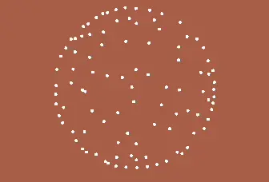

# Position Based Fluids
As discussed in [Position Based Simulation](position-based.md), position-based dynamics provided the foundations of simulating lagrangian fluids. Remember PBD is all about how to put constraints on particles and how to resolve them. Similarly, we can model how fluid particles interact by posing some constraints on them.

## Density Constraint
The density constraint[^1] aims to model the [compressibility on fluids](https://en.wikipedia.org/wiki/Compressibility) by constraining the density (measuring the amount of mass per unit volume) of a single fluid particle.

$$
C_i(\mathbf{x}_1, \cdots, \mathbf{x}_\mathbf{n_j}) = \frac{\rho_i}{\rho_o}-1
$$

$$
\rho_i = \sum_j{m_j W(\mathbf{x}_i - \mathbf{x}_j, h)}
$$

Since we only care about local density around a given particle, the density constraint takes all its neighboring particle positions $\mathbf{x}_1, \cdots, \mathbf{x}_\mathbf{n_j}$, and sum up their masses to $\rho_i$. Noted that each particles are weighted by a smoothing function $W$ that falls off radially from the center of the kernel, which we will discuss more in the [smoothing kernel](#smoothing-kernels) section. The ratio to its rest density $\rho_o$ is then evaluated, indicating whether the fluid is being compressed locally (e.g. $\rho_i > \rho_o$). In a perfect equilibrium, $\rho_i$ should equal to $\rho_o$ and the constraint $C_i=0$ will be satisfied, meaning this fluid particle is happy :)

$$
C_{density}(\mathbf{x}) =
\begin{cases}
C_1(\mathbf{x}_1, \cdots, \mathbf{x}_\mathbf{n_j}) = 0\\
\cdots\\
C_N(\mathbf{x}_1, \cdots, \mathbf{x}_\mathbf{n_j}) = 0\\
\end{cases}
$$

Scaling up the above to a $N$-particle simulation, every particles will be assigned a density constraint, to ensure its local density remain the same at all time. This is why the bilateral condition $C(\mathbf{x})=0$ is used here. Once we run the solver for a decent number of iterations, every fluid particles should be happily resting at their stable positions.

!!! thonk "What if the density is lower than the rest condition (e.g. $\rho_i < \rho_o$)?"
    There will be cases where a lone particle wandered into the void, where a few or even no neighboring particles are present in its surroundings. This posed a tensile instability in our simulation, which can cause clustering or clumping due to negative pressures.
    
    This can result in extreme correction vectors and can break the simulation. One solution is to clamp the density constraint result to zero to prevent negative pressure.

    $$
    C_i(\mathbf{x}_1, \cdots, \mathbf{x}_\mathbf{n_j}) = \max(0, \frac{\rho_i}{\rho_o}-1)
    $$

    However, this also means the cohesion nature of fluid particles is gone, particles almost always repel with each other. So by clamping the constraint, we are also limiting ourselves from having this cohesive behavior.

    Luckily, in the paper "SPH without a tensile instability"[^2], an artificial pressure correction factor is proposed. Where $\Delta\vec{q}$ is vector to a point at some fixed distance inside the smoothing kernel radius $h$ and $k$ is a small positive constant. $\|\Delta\vec{q}\|=\{0.1h, \cdots, 0.3h\}$, $k = 0.001$ and $n = 4$ work well in my case.

    $$
    \lambda_{corr}=-k\cdot\left(\frac{W(\vec{r}, h)}{W(\Delta\vec{q}, h)}\right)^n
    $$

### Smoothing Kernels
Smoothing kernels are essential for integrating local density of a particle in an SPH simulation. A good kernel needs to fulfill a few requirements:

- Radially symmetric (i.e. only depends on distance)
- Finite support (i.e. particles should only affect up to a certain distance)
- Differentiable and integrates to 1

|Kernel Type|Definition|
|:--:|:--:|
|Poly6 (2D)|$W_{poly6}(\vec{r}, h) = \frac{4}{\pi h^8} \begin{cases} (h^2-\|r\|^2)^3 & \text{if } 0\leq \|r\|\leq h\\ 0 & \text{else} \end{cases}$|
|Poly6 (3D)|$W_{poly6}(\vec{r}, h) = \frac{315}{64 \pi h^9} \begin{cases} (h^2-\|r\|^2)^3 & \text{if } 0\leq \|r\|\leq h\\ 0 & \text{else} \end{cases}$|
|Spiky (2D)|$W_{spiky}(\vec{r}, h) = \frac{10}{\pi h^5} \begin{cases} (h-\|r\|)^3 & \text{if } 0\leq \|r\|\leq h\\ 0 & \text{else} \end{cases}$|
|Spiky (3D)|$W_{spiky}(\vec{r}, h) = \frac{15}{\pi h^6} \begin{cases} (h-\|r\|)^3 & \text{if } 0\leq \|r\|\leq h\\ 0 & \text{else} \end{cases}$|

[^1]: Macklin, M., & Müller, M. (2013). Position based fluids. ACM Transactions on Graphics (TOG), 32(4), 1-12.
[^2]: Monaghan, J. J. (2000). SPH without a tensile instability. Journal of computational physics, 159(2), 290-311.

## Bloopers
|1|2|3|
|:--:|:--:|:--:|
|||