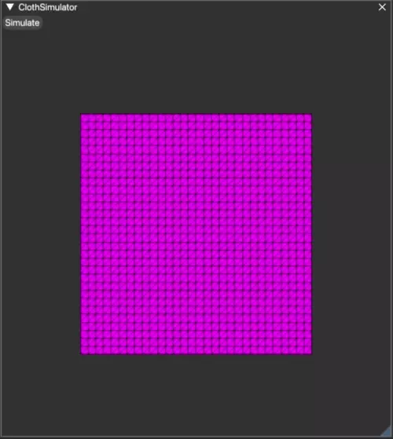

# Position Based Simulation
As oppose to any other rigidbody simulations, [force-based](force-based.md) and [impulse-based](impulse-based.md) that deals with velocity and acceleration calculations, position-based simulation attempts to minimize the constrains on the position domain down to particle level. The main benefits of PBD is that it's not suppose to suffer from overshooting problem.

## Problem
Given a set of $M$ constrains (basically means there are $M$ equality or inequality equations to satisfy), we need to solve for $N\times\mathbb{R}^3$ unknowns to resolve our final positions. Most of the time, the number of constraints won't match the number of unknowns we are solving (i.e. $M \neq N$). This means if the problem was a linear system $\mathbf{A}\mathbf{x}=\mathbf{b}$, the solution can't be obtained easily by inverting the matrix and solve for $\mathbf{x}$. Not to mention the system we are solving won't necessarily be linear, for example a simple distance constraint $c(\mathbf{x}_1, \mathbf{x}_2)=\left|\mathbf{x}_1-\mathbf{x}_2\right|^2-d^2$ alone is a non-linear equation.

Thus, it all boils down to a complex problem of finding a set of positions $\mathbf{x}$ that minimize if not solved the constrained system:

$$
C(\mathbf{x}) = \left\{\\
\begin{array}\\
c_1(\mathbf{x}_0, \mathbf{x}_1, \cdots, \mathbf{x}_N) \succ 0\\
\cdots\\
c_M(\mathbf{x}_0, \mathbf{x}_1, \cdots, \mathbf{x}_N) \succ 0\\
\end{array}\\
\right.
$$

Where $\mathbf{x}$ is the concatenation of $N\times\mathbb{R}^3$ position unknowns we are trying to solve, and the symbol $\succ$ denotes either $=$ or $\geq$. As said, there won't be closed form solution because the system is neither symmetric nor linear. Our best bet is to apply an iterative solver to minimize the system after a fixed amount of iterations and hope for the best that the approximated result will satisfy all our constraints. 

## Algorithm
The main position based dynamics (PBD) algorithm can be split into three different stages: prediction, constraint projection, and post-solve updates.

$$
\begin{align}
&\mathbf{while}\ \text{simulating}\\
&\quad \mathbf{for} \text{ all particles } i\\
&\quad\quad \mathbf{v}_i \leftarrow \mathbf{v}_i + \mathbf{f}_{ext}\Delta t\\
&\quad\quad \mathbf{p}_i \leftarrow \mathbf{x}_i + \mathbf{v}_i\Delta t\\
&\quad \mathbf{for} \text{ all constraints } C\\
&\quad\quad solve(C, \Delta t)\\
&\quad \mathbf{for} \text{ all particles } i\\
&\quad\quad \mathbf{v}_i \leftarrow (\mathbf{x}_i - \mathbf{p}_i) \frac{1}{\Delta t}\\
&\quad\quad \mathbf{x}_i \leftarrow \mathbf{p}_i
\end{align}
$$

### Integration

## Result

[^1]: Jan Bender, Mattias Müller, Miles Macklin. _Position-Based Simulation Methods in Computer Graphics, Eurographics 2015_. [http://mmacklin.com/EG2015PBD.pdf](http://mmacklin.com/EG2015PBD.pdf)