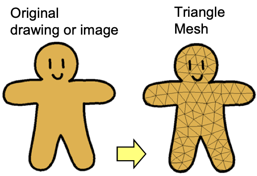
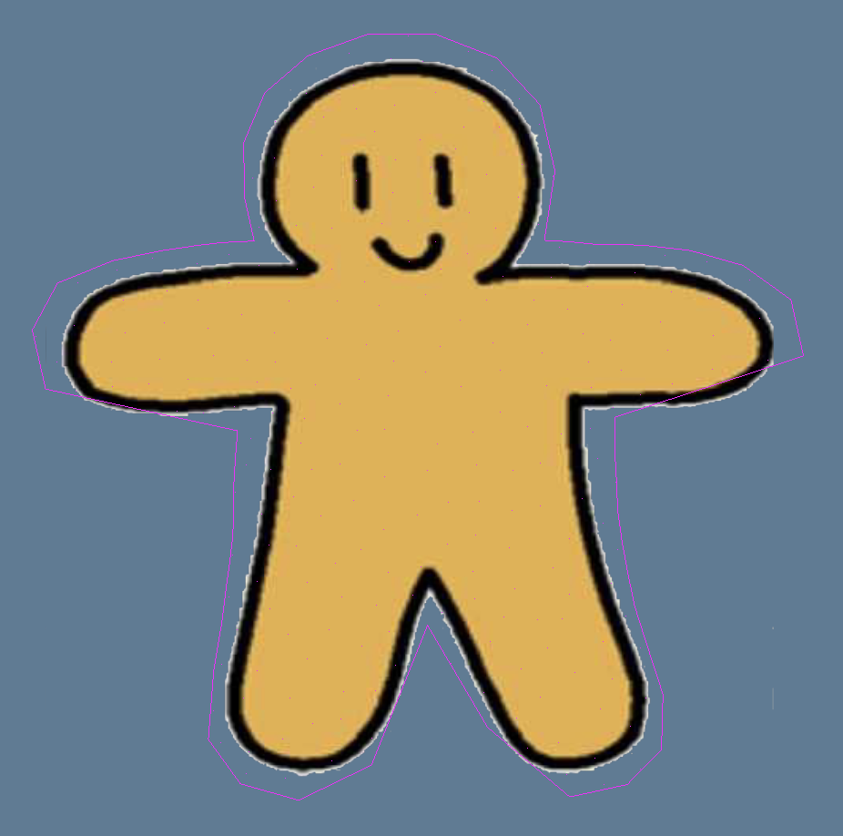

# Image Auto-Mesh

This is a part of the bigger project that I'm working on (Spoiler: [ARAP](https://www-ui.is.s.u-tokyo.ac.jp/~takeo/papers/rigid.pdf)). My goal is to automatically generate a triangulated mesh around an RGBA image. But I can already tell there are few obvious obstacles/problems along the way need to be tackled.

1. Generating contours around the image is hard, especially if the edges aren't smooth, of which can occur naturally for irregular brush strokes.
2. Contours cannot be self-intersecting, no one wants that.
3. Triangle sizes and shape are really important. They must be mostly equiangular and evenly distributed to minimize texture stretching when deformed.
4. ... I will add more to this when I can think of anything

## Contouring
Contour here means the exterior [polygonal chain](https://en.wikipedia.org/wiki/Polygonal_chain) that bounds the target shape, in this case, wherever the alpha channel of the image is non-zero. 

In the original ARAP paper, which has quite some history I know, uses marching squares to extract the contour. Of course it wouldn't be so easy if you remember one of the the above challenges. 

Yes, the target shape can have rough edges! That means after running the marching squares algorithm, the bounding polygon is very much jagged like a coastline. Normally this wouldn't be a problem, but I want to deform the mesh after this geometry processing. So less triangles/vertices = faster deformation. 

Honestly, we can apply some line segment decimation algorithms like the [Ramer-Douglas-Perucker](https://en.wikipedia.org/wiki/Ramer–Douglas–Peucker_algorithm) and [Visvalingam-Whyatt](https://en.wikipedia.org/wiki/Visvalingam–Whyatt_algorithm) algorithm. Yeah, they will do the job, but that's extra work. Not only it takes time to compute, but also it can open a can of worms with exceptional cases and potentially self-intersecting contour. 

Besides, the input image can have multiple contours for disconnected shapes. Just imagine a donut, two circles. Well, it's not really a problem. But for my design, I don't need to extract the inner contour, only the silhouette is sufficient. 

### My Solution
So what I have in mind is some simpler, a naive approach. Just hear me out. 

What if... what if, like a shrinking plastic wrap, start with an N-gon, then find the closest intersection with the target shape. That has to work, right? 

The process goes like this: 

I get the center of the bounding box of all the opaque pixels as the center of the N-gon. Or, I can use the centroid of those pixels, not sure which is better. Then I construct a line segment running from the N-gon's vertex to the center as my "ray". After that, finding the closest intersection was just a matter of implementing the [Differential Diagnosis (DDx)](https://www.google.com/url?sa=t&source=web&rct=j&opi=89978449&url=https://en.wikipedia.org/wiki/Differential_diagnosis&ved=2ahUKEwjI6qDp79uMAxUfHjQIHXW7HbMQFnoECB8QAQ&usg=AOvVaw2pNwTcmNGopCeEvIwUB4MK) algorithm and step towards the center. This gives me the distance to the closest opaque hit. 

But of course we don't want the final constructed mesh to "eat" away part of the image, so padding was necessary. Adding padding is simple, just subtract a certain amount from the closest hit distance.

{:style="width:20rem"}

And when you really think about it, it will NEVER generate a self-intersecting contour. Think of a pizza, shrinking the N-gon vertices is just like biting away an uncut pizza's crust (by the way, that's not how you eat a pizza). My point is, it will always remain a non-intersecting polygon. 

The only criticism are, 

1. Line segments are non-uniform. Concave areas have steep edges because of the large differences in DDx hit distance. 
2. Elongated/spiky shapes can have extruded areas where the insufficiently subdivided N-gon can totally missed the intersection. (I couldn't figure out how to resolve this case yet)

For the non-uniform edges, I could either run an iterative line segment relaxation process until they are evenly distributed, or better approach is to subdivide and interpolate the curve if it exceeded the maximum edge length. 

## Meshing
Good contour, huh? How to turn it into a triangle mesh? We couldn't just do a [ear clipping triangulation](https://en.wikipedia.org/wiki/Two_ears_theorem), that's embarrassing. And bad triangulation leads to all kinds of texture stretching after deformation. 

### Poisson Disk Sampling

### Delaunay Triangulation