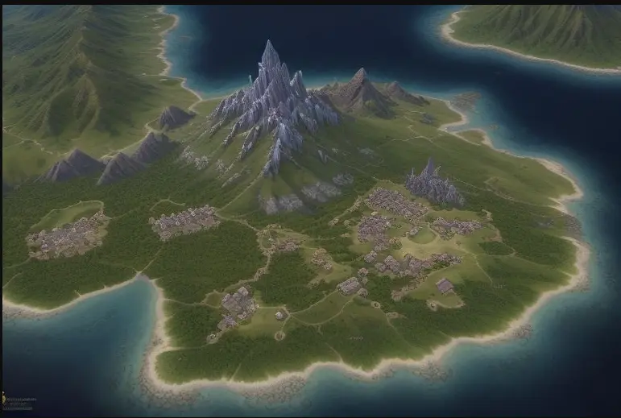
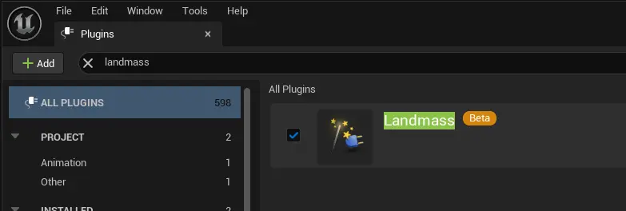
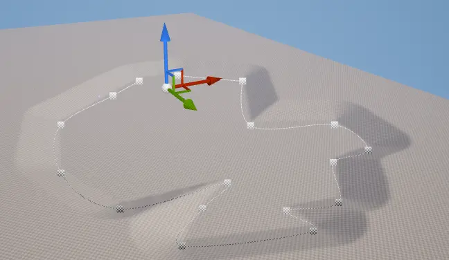
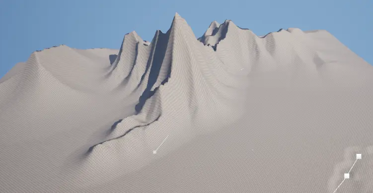
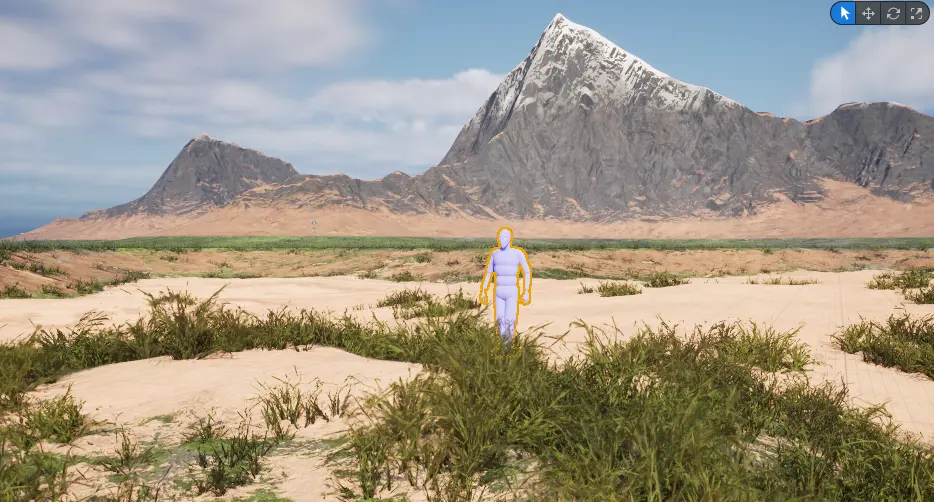
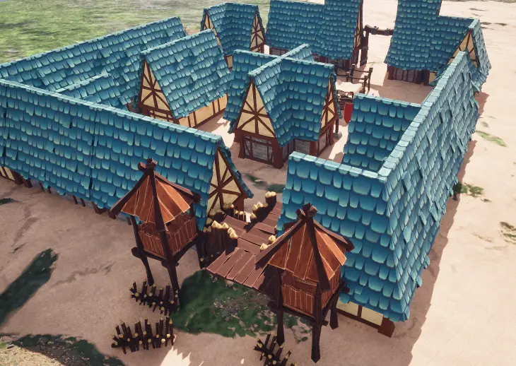
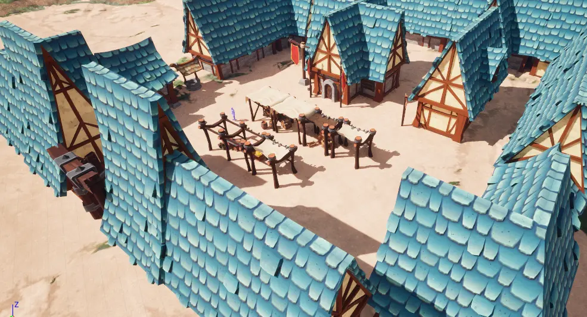

# Unreal Engine 5 Landscape
I've been wanted to try out the landscape tool in UE5. I am never a terrain guy, never got any sense and talent to make my own landscape like an artist does. But I am willing to try to do something new. The Unreal Engine provides a lot of different sophisticated tools with amazing graphics performance. This will be a great starting point for me.

For this article, I will be mainly following this [YouTube video](https://www.youtube.com/watch?v=6_5_GiYgCis) that gives a solid foundation of how the landscape tool works in UE. Of course I won't blindly follow tutorials. Just for the sake of learning, I have used an AI tool to generate a landscape as my reference, and attempting to recreate this inside Unreal.

## Landmass Tool
This is an experimental tool in UE at the time of writing, so I have to enable it manually through the plugins. This provides the ability to model landscapes through blueprint, whatever that means, it's just a better tool than the traditional hand-painted terrain. 

I found out that it was also a non-destructive way of modeling landscape. The normal painting tools can be quite difficult to control. Since most of the time you won't know what will be the final look, moving landscape features and re-sculpting are very common while making maps. For instance, the following mountains are made with multiple blueprint brushes with additive blend mode. 

## Texturing
Of course gray mountains and basins are boring, time to add material to the landscape to preview how it looks. I am using the free plugin [MW Landscape Auto Material](https://www.unrealengine.com/marketplace/en-US/product/mw-auto-material) available in the UE marketplace. As this is an automatic tool that splat textures onto the landscape based on the elevation in world space. Tuning the parameters is actually very easy and intuitive. I am able to quickly to set it up and did a screenshot of the progress I made so far.

